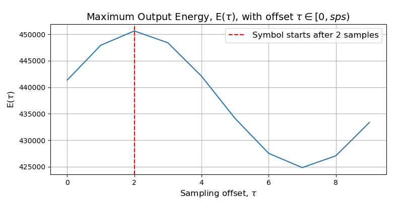
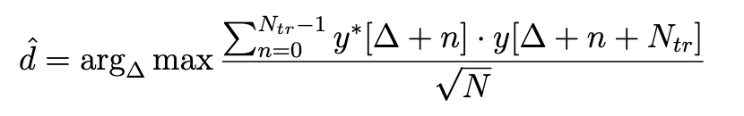
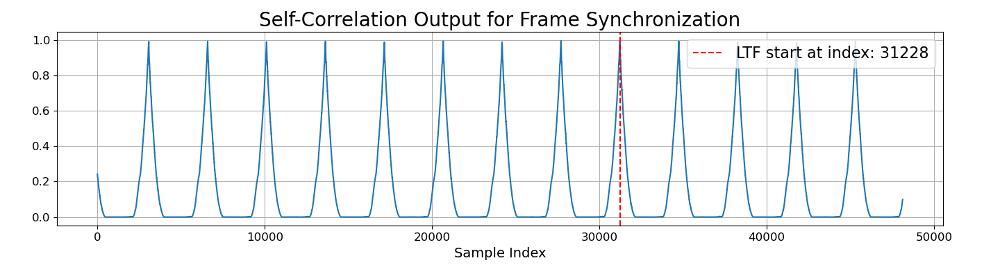
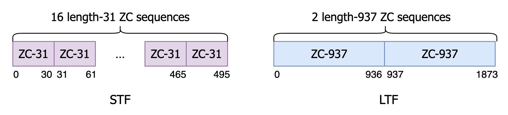
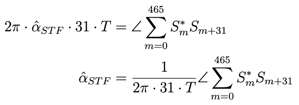
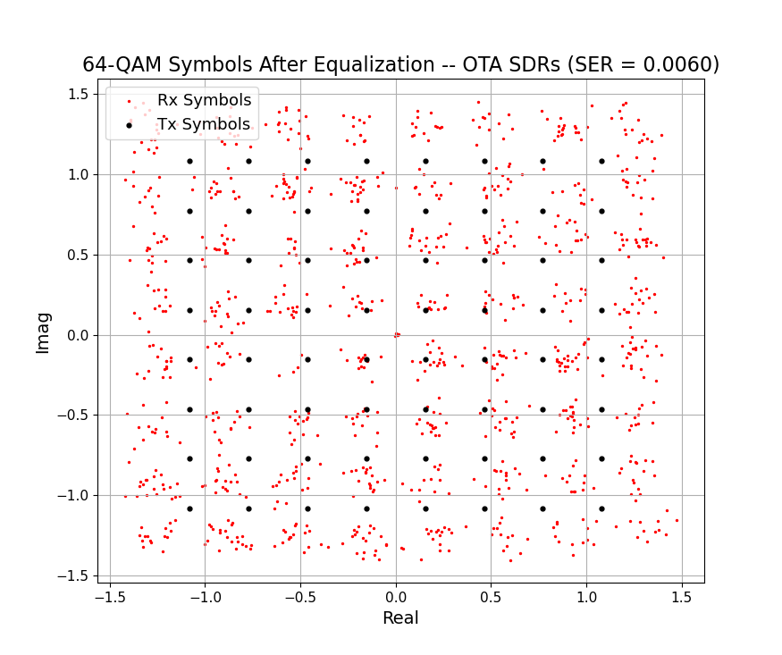
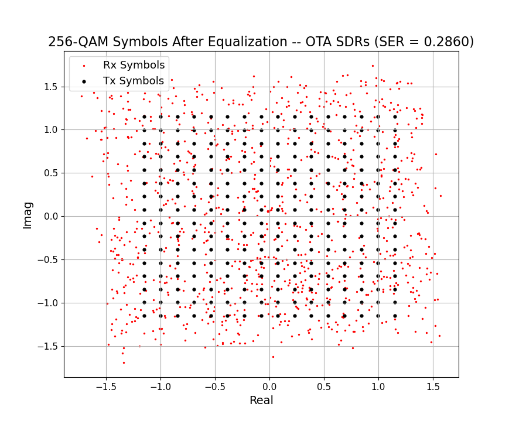
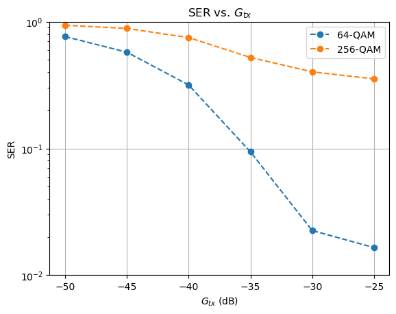

# SDR QAM Transceiver
This project implements a complete digital communication system using Software Defined Radio (SDR). It transmits a QAM-modulated signal over the air between two seperate SDR devices and performs all essential baseband processing steps on the receiver side, including:
- Matched filtering
- Symbol synchronization
- Frame synchronization
- Coarse and fine Carrier Frequency Offset (CFO) correction
- Channel estimation and equalization
- Symbol detection and Symbol Error Rate (SER) evaluation

## File Description
- `main.py`: The main script that runs the full transmit-receive pipeline. It sets up the Pluto SDR, performs all signal processing steps, and evaluates SER.
- `ece230b.py`: Contains all utility functions used in the project.
- `plot_util.py`:  Contains all plotting functions used to visualize frame structure, time-domain signals, and constellation diagrams.

## Signal Processing Flow and Visualization

### Frame Layout

The transmit signal is structured as follows:
- Short Training Field (STF) consists of 16 identical length-31 Zadoff-Chu symbols
- Long Training Field (LTF) consists of 2 identical length-937 Zadoff-Chu symbols
- 50 pilot symbols `constellation[0]` for channel estimation
- 1000 payload symbols
- 100 zero-padding symbols

### Symbol Synchronization
To extract symbols from a matched-filtered received signal, the signal is evaluated at different sample offset ($\tau=0, ..., sps-1$) using the **Maximum Energy Output (MOE)** method. The optimal sample offset is the one that yields the highest energy. As shown below, the MOE peaks at $\tau=2$. Therefore, the signal is downsampled by $sps=10$, starting from index 2 (i.e., `filtered_rx_signal[sample_offset::sps]`) to extract the symbols.

### Frame Symchronization
<!-- Since the the Pluto SDR transmits multiple identical copies of the signal, we need to extract a single frame from the repeated copies at the receiver. To do this, we perform **self-correlation** on the symbol-synchronized signal, using a correlation length of `zc_len_long = 937`, which matches the length of the Long Training Field (LTF). 

The correlation result shows several peaks, each indicating a repeated copy. We choose the peak with the highest value, located at index `d`. The figure below shows that this peak occurs at index d = 31228.

The start of the frame is computed by substracting the length of Short Training Field (STF) from d: `start_index = d - zc_len_short * zc_count_short`.

The end of the frame is then calculated as: `end_index = start_index + N_frame`, where `N_frame` is the number of symbols in a fame. -->

Frame synchronization is performed by detecting the starting index of a repeated Long Training Field (LTF) in the symbol-synchronizaed signal using the following steps:
- A sliding window moves across the signal to compute the complex correlation between each segment and its delayed version.
- The magnitude of this correlation peaks when the two repeated sequences (e.g., two LTFs) are aligned.
- the index at which this peak occurs is the estimated start of the LTF sequence.

The estimated starting index $\hat{d}$ of the LTF sequence is obtained by:

where $y[n]$ is the received signal, $N_{tr}=937$ is the length of a LTF sequence, and $\Delta$ is the starting index of the current window.

The figure below shows that this peak occurs at index d = 31228.

The total length of Short Training Sequence (STF) is then subtracted from $\hat{d}$ to get the starting index of the frame: 

`start_index = d - zc_len_short * zc_count_short`.

Using this index, we extract `N_frame` symbols starting from `start_index`.

** Question:  Why is self-correlation-based fame synchronization more robust to the presence of CFO than directly correlating with a known Zadd-off Chu sequence?**

In the presence of carrier frequency offset (CFO), the received signal experiences a time-varying phase rotation: $y[n] = x[n] \cdot e^{j2\pi \Delta nT}$, where $x[n]$ is the transmit sample, $\Delta$ is the CFO, $n$ is the sample index, and $T$ is the symbol period.

If we directly correlate the CFO-affected received signal with a known Zadoff-Chu sequence (which does not have CFO-induced phase rotations), the correlation degrades because the relative phase difference between corresponding samples in the received signal and the Zadoff-Chu sequence varies, which reduces the correlation peak and makes synchronization less reliable.

In contrast, self-correlation compares two segments of the received signal that are N samples apart. Both segments experience the same CFO-induced phase, so their relative phase difference is constant:  $e^{j2\pi \Delta NT}$.

The constant factor affects all correlation terms equally and thus cancels out the CFO effect. As a result, the self-correlation peak remains strong, making the method more robust to CFO.

### Frequency Synchronization - CFO correction
The carrier frequency offset (CFO), denoted as α, is the difference between the transmitter's and receiver's carrier frequencies: $α = f_{c, tx} - f_{c, rx}$.

The 16 identical length-31 Zadoff-Chu sequences in **Short Training Field (STF)** are used for coarse CFO estimation. The symbols in this segment can be denoted as $S_m$, where $m=0,...,495$. The coarse CFO estimation is given by:

Once the coarse CFO estimation is obtained, correction is applied to the **Long Training Sequence (LTF)** symbols, denoted by $L_m$ for $m=0,...,1873$.

The fine CFO is then estimated from the LTF using a similar approach:

The final CFO estimation $α̂ = α̂_{STF} + α̂_{LTF}$ is then used to correct the CFO by multiplying the received signal by $e^{-j2\pi α̂ nT}$.

** Question:  Why do we use two types of Zadoff-Chu sequences—16 identical Short Training Fields (STFs) and 2 identical Long Training Fields (LTFs)—to estimate CFO instead of using only the LTFs**

The maximum detectable carrier frequency offset (CFO) is limited by the correlation length and is given by: $|\Delta| \leq \frac{1}{2N_{tr}\cdot T}$, where $N_{tr}$ is the length of the Zadoff-Chu sequence and $T$ is the symbol period.

There is a tradeoff between $N_{tr}$ and the maximum detectable range of CFO:
- A longer Zadoff-Chu sequence (large $N_{tr}$) improves the SNR of the correlation and enables more accurate CFO estimation, but it reduces the maximum detectable CFO range.
- A shorter sequence allows for a wider detectable CFO range, but suffers from noisier correlation and less precise estimation.

Therefore, the system uses both short and long sequences to balance range and accuracy:
1. The short ZC-31 sequence in the STF is used to obtain a coarse CFO estimate with a wide detection range.
2. The long ZC-937 sequence in the LTF is then used to refine the estimate and perform fine CFO estimation.

### Channel Equalization
Suppose the channel is flat fading. The channel is estimated using the **Least Squares (LS) method**. 

The estimated channel response is given by: $\hat{h}_{LS} = \frac{\bar{x}\cdot y}{\bar{x}\cdot x}$, where $x$ is the known transmit pilot symbol, $y$ is the received pilot symbol, and $\bar{x}$ denotes the complex conjugate of $x$.

## Result
Over-the-air (OTA) transmission between two SDRs with a transmit gain of –10 dB and receive gain of 40 dB produced a symbol error rate (SER) of **0.0060** for 64-QAM and **0.2860** for 256-QAM. The significantly higher SER in 256-QAM can be attributed to its higher modulation order.

Additionally, the use of a single complex channel estimate to equalize all payload symbols may not sufficiently compensate for channel variation or frequency selectivity present in the OTA environment, further impacting high-order modulation performance.

The **total estimated CFO** is **–517.087 Hz**, composed of a **coarse CFO estimate** of **–518.321 Hz** and a **fine CFO correction** of **+1.234 Hz**.

The following two plots show the received symbols after equalization for 64-QAM and 256-QAM on the complex plane. The red points represent the received symbols, and the black points represent ideal transmitted constellation points.

The plot below illustrates how SER varies with transmit gain $G_{tx}$ for 64-QAM and 256-QAM in OTA transmissions between two SDRs. As $G_{tx}$ increases from –50 dB to –25 dB, the SER decreases for both modulation schemes due to increased transmit power. However, 256-QAM consistently exhibits higher SER than 64-QAM across all transmit gains. The improvement trend for 64-QAM becomes more pronounced at higher transmit gains, whereas 256-QAM shows only moderate improvement, suggesting it is more vulnerable to residual impairments in the hardware and the signal processing pipeline (e.g., limited channel estimation and synchronization accuracy). 

 