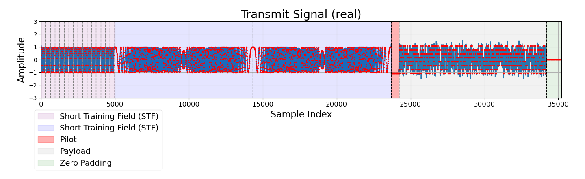
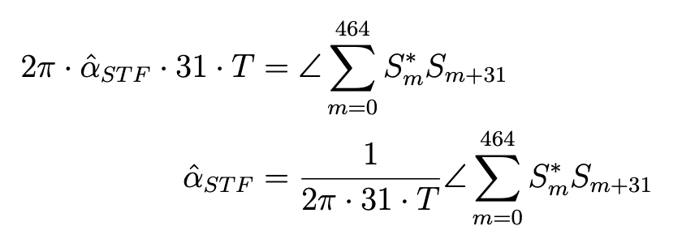
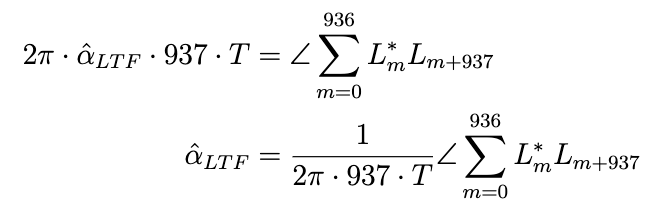

# SDR QAM Transceiver
This project implements a complete digital communication system using Software Defined Radio (SDR). It transmits a QAM-modulated signal over the air and performs all essential baseband processing steps on the receiver side, including:
- Matched filtering
- Symbol synchronization
- Frame synchronization
- Coarse and fine Carrier Frequency Offset (CFO) correction
- Channel estimation and equalization
- Symbol detection and Symbol Error Rate (SER) evaluation

## File Description
- `main.py`: The main script that runs the full transmit-receive pipeline. It sets up the Pluto SDR, performs all signal processing steps, and evaluates SER.
- `ece230b.py`: Contains all utility functions used in the project.

## Signal Processing Flow and Visualization

### Frame Layout

### Frequency Synchronization - CFO correction

The 16 identical length-31 Zadoff-Chu sequences in **Short Training Field (STF)** are used for coarse CFO estimation. The symbols in this segment can be denoted as $S_m$, where $m=0,...,965$. The coarse CFO estimation is given by:

Once the coarse CFO estimation is obtained, correction is applied to the **Long Training Sequence (LTF)** symbols, denoted by $L_m$ for $m=0,...,1873$.

The fine CFO is then estimated from the LTF using a similar approach:

The final CFO estimation α̂ = α̂_{STF} + α̂_{LTF} is used to correct the CFO for the remaining part of the frame.

The plot below shows the pilot symbols after CFO correction and the equalized received symbols on a complex plane.

